# Guide utilisateur — LoanlyPro

> Documentation fonctionnelle du MVP LoanlyPro (gestion des demandes de prêt, instruction, remboursements et services associés).
>
> **Version :** MVP · **Dernière mise à jour :** juillet 2026  
> **Application :** [https://pfr-dev.web.app](https://pfr-dev.web.app) (environnement de démonstration)

---

## Sommaire

1. [À propos de LoanlyPro](#1-à-propos-de-loanlypro)
2. [Accès et comptes](#2-accès-et-comptes)
3. [Premiers pas — créer un compte](#3-premiers-pas--créer-un-compte)
4. [Espace client](#4-espace-client)
5. [Espace conseiller](#5-espace-conseiller)
6. [Espace administrateur](#6-espace-administrateur)
7. [Notifications](#7-notifications)
8. [Messagerie](#8-messagerie)
9. [Conseiller IA et formation](#9-conseiller-ia-et-formation)
10. [Aide et support](#10-aide-et-support)
11. [Annexes](#11-annexes)

---

## 1. À propos de LoanlyPro

**LoanlyPro** est une plateforme en ligne qui permet :

- aux **clients** de déposer et suivre une demande de prêt, de gérer leurs documents et leurs remboursements ;
- aux **conseillers** d'instruire les dossiers qui leur sont affectés (analyse, validation des pièces, proposition d'offre, décision) ;
- aux **administrateurs** de superviser l'ensemble des demandes, des utilisateurs et de l'affectation des conseillers.

### Les trois espaces

| Espace | Qui ? | URL après connexion |
|--------|-------|---------------------|
| Client | Demandeur de prêt | `/dashboard` |
| Conseiller | Chargé d'instruction | `/conseiller/dashboard` |
| Administrateur | Supervision plateforme | `/admin/dashboard` |

---

## 2. Accès et comptes

### URL de l'application

- **Démonstration / staging :** [https://pfr-dev.web.app](https://pfr-dev.web.app)
- **Production :** [https://pfr-prod.web.app](https://pfr-prod.web.app) *(selon déploiement)*

### Comptes de démonstration (jeu de données seed)

Ces comptes sont préchargés pour les démos et tests :

| Rôle | Exemple d'e-mail | Mot de passe |
|------|------------------|--------------|
| Client | `client.seed.01@loanlypro.fr` | `LoanlyPro2026!` |
| Conseiller | `conseiller.seed.01@loanlypro.fr` | `LoanlyPro2026!` |
| Administrateur | `admin.seed.01@loanlypro.fr` | `LoanlyPro2026!` |

> Les clients seed vont de `client.seed.01` à `client.seed.25`, les conseillers de `conseiller.seed.01` à `conseiller.seed.04`.

---

## 3. Premiers pas — créer un compte

### 3.1 Page d'accueil

Depuis la page d'accueil, vous pouvez vous **connecter** ou **créer un compte**.

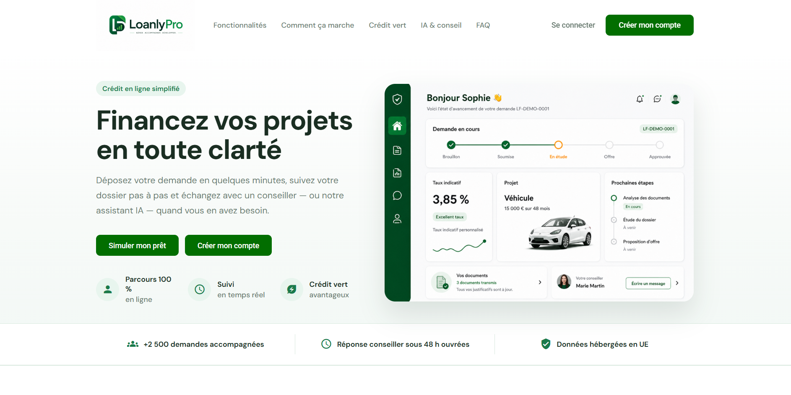  
*Figure 1 — Page d'accueil (visiteur non connecté)*

### 3.2 Inscription

1. Cliquez sur **S'inscrire**.
2. Renseignez prénom, nom, e-mail et mot de passe.
3. Validez le formulaire.

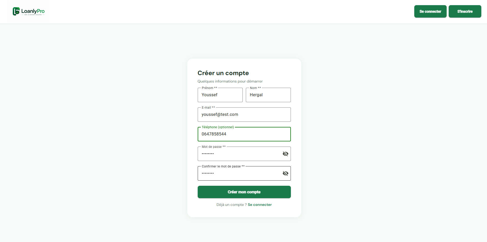  
*Figure 2 — Création de compte client*

### 3.3 Vérification de l'e-mail

Après l'inscription, un **code de vérification** vous est envoyé par e-mail.

1. Saisissez le code sur la page de vérification.
2. En environnement de démo, le code fixe peut être `000000` (selon configuration serveur).
3. Si le code expire, utilisez **Renvoyer le code**.

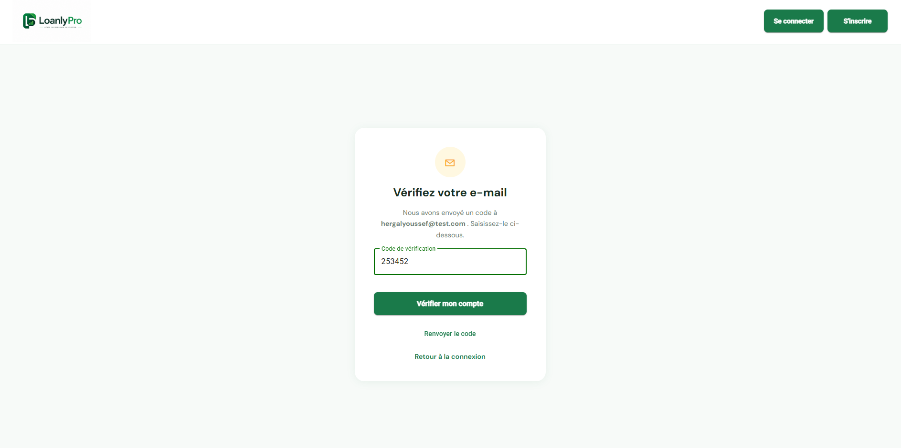  
*Figure 3 — Validation de l'adresse e-mail*

### 3.4 Connexion

1. Accédez à **Connexion**.
2. Entrez votre e-mail et mot de passe.
3. Vous êtes redirigé vers votre espace selon votre rôle.

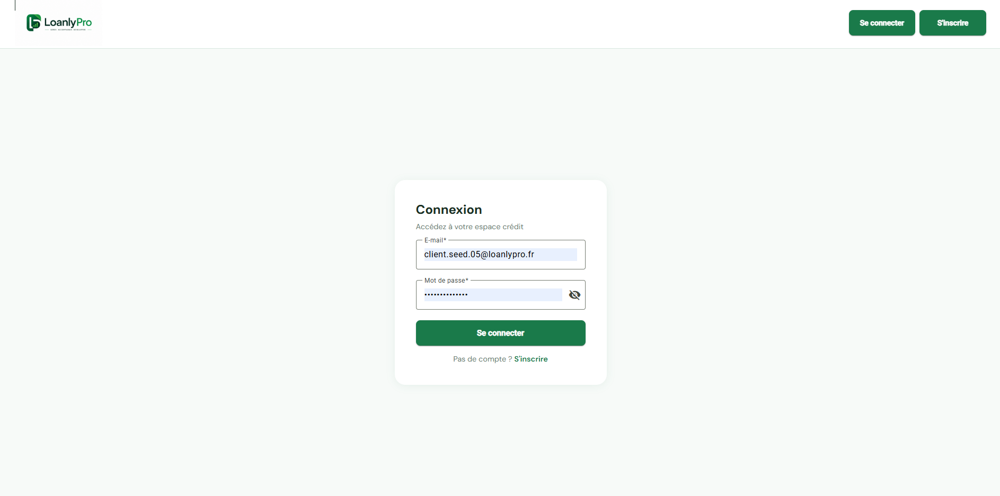  
*Figure 4 — Connexion*

---

## 4. Espace client

L'espace client est accessible après connexion avec un compte **client**. Le menu latéral donne accès au tableau de bord, aux demandes, aux prêts, aux paiements, aux messages, etc.

### 4.1 Tableau de bord

Le tableau de bord résume votre activité : demandes en cours, raccourcis vers une **nouvelle demande**, alertes mandat ou documents.

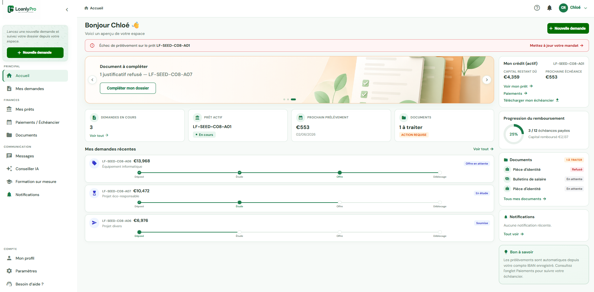  
*Figure 5 — Tableau de bord client*

### 4.2 Déposer une nouvelle demande de prêt

Le parcours est guidé en **4 étapes** :

| Étape | Contenu |
|-------|---------|
| 1. Besoin | Montant, durée, objet du prêt |
| 2. Situation | Revenus, charges, emploi |
| 3. Documents | Pièces justificatives obligatoires |
| 4. Récapitulatif | Vérification + acceptation des CGU |

#### Étape 1 — Besoin

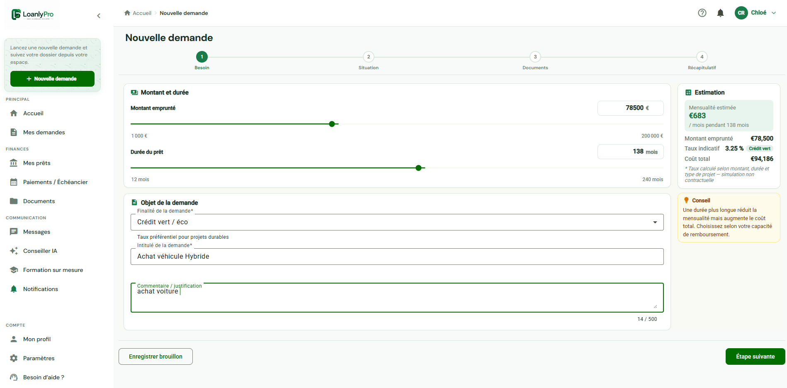  
*Figure 6 — Étape « Besoin »*

#### Étape 2 — Situation professionnelle et financière

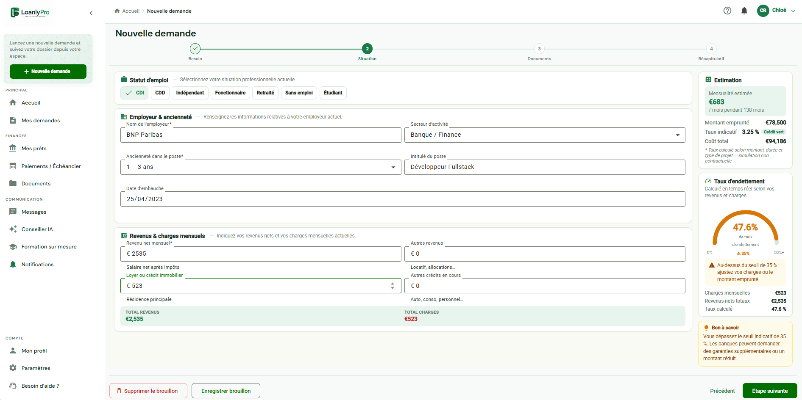  
*Figure 7 — Étape « Situation »*

#### Étape 3 — Documents

Documents requis (MVP) : pièce d'identité, bulletins de salaire, avis d'imposition, relevés bancaires, justificatif de domicile.

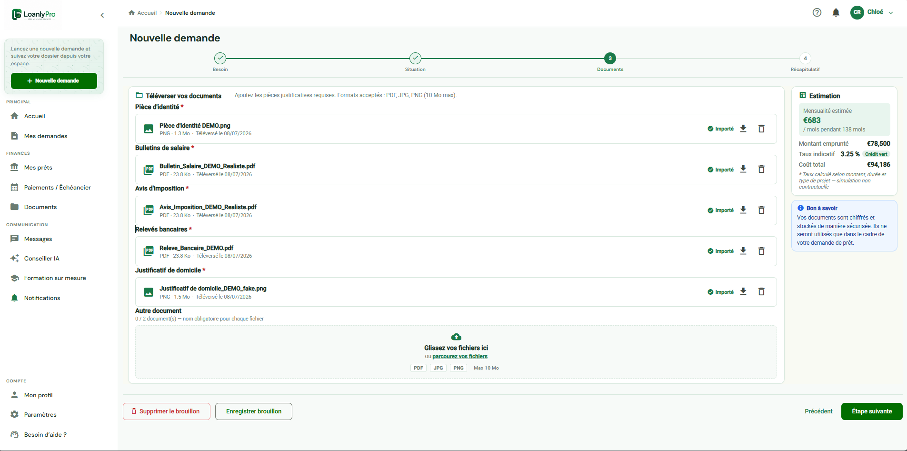  
*Figure 8 — Dépôt des justificatifs*

#### Étape 4 — Récapitulatif et soumission

Vérifiez les informations, acceptez les conditions, puis cliquez sur **Soumettre**.

> **Important :** après soumission, le formulaire et les documents ne sont plus modifiables. La demande passe au statut **Déposé**.

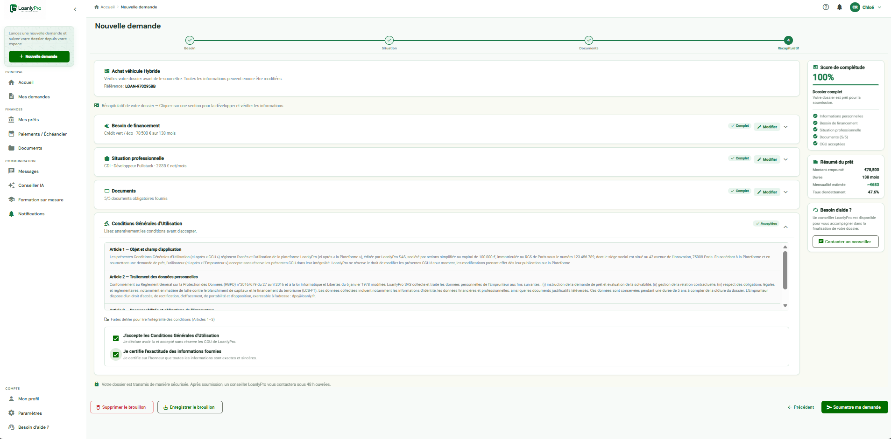  
*Figure 9 — Récapitulatif avant envoi*

#### Confirmation

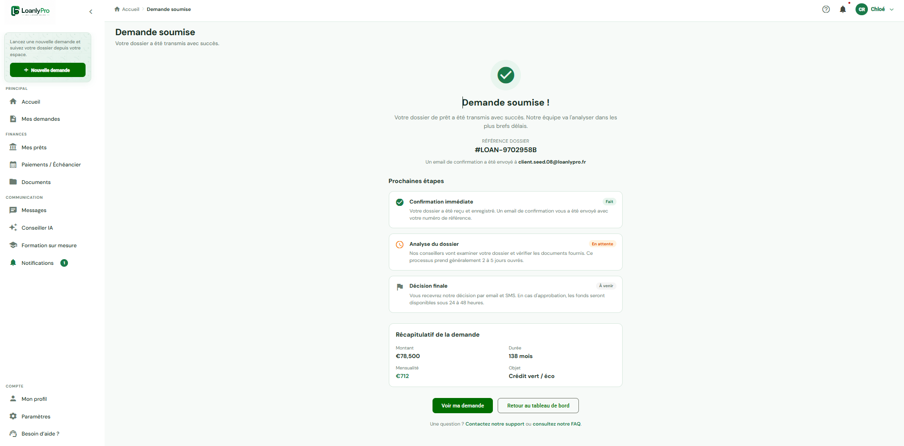  
*Figure 10 — Confirmation de soumission*

### 4.3 Brouillon et reprise

Tant que la demande n'est pas soumise, elle reste en **Brouillon**. Retrouvez-la dans **Mes demandes** pour la compléter ou la supprimer.

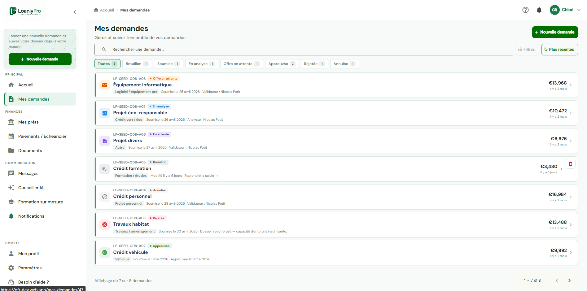  
*Figure 11 — Liste des demandes*

### 4.4 Suivre l'avancement d'un dossier

Ouvrez une demande pour voir :

- le **statut** actuel ;
- la **timeline** (historique des événements) ;
- les **documents** et leur état de validation ;
- les actions possibles (accepter/refuser une contre-offre, déposer un complément, annuler…).

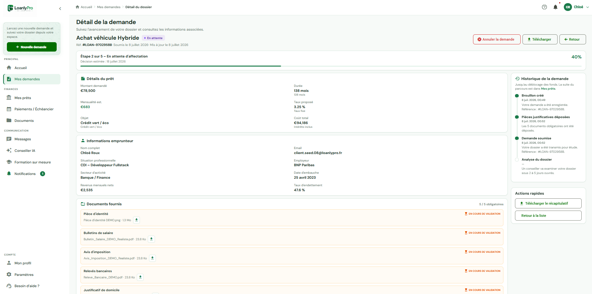  
*Figure 12 — Détail et suivi du dossier*

### 4.5 Contre-offre du conseiller

Si le conseiller propose des conditions différentes de votre demande initiale, vous recevez une **contre-offre** (statut *Offre en attente*).

- **Accepter** : le dossier reprend l'analyse vers l'approbation.
- **Refuser** : vous pouvez laisser un commentaire ; le dossier reste en analyse.

  
*Figure 13 — Réponse à une contre-offre*

### 4.6 Document à corriger

Si une pièce est rejetée, un libellé **Document à corriger** apparaît. Déposez un **complément** depuis le détail du dossier (uniquement tant que le dossier est *En étude*).

  
*Figure 14 — Complément documentaire*

### 4.7 Après approbation — Mes prêts et mandat SEPA

Une fois la demande **Approuvée**, un **prêt** est créé avec un plan de remboursement.

1. Allez dans **Mes prêts**.
2. Ouvrez le prêt concerné.
3. Configurez votre **IBAN** et activez le **mandat de prélèvement SEPA**.

  
*Figure 15 — Liste des prêts*

  
*Figure 16 — Configuration du mandat de prélèvement*

### 4.8 Paiements et échéancier

La page **Paiements / Échéancier** affiche les échéances à venir, payées ou en retard.

  
*Figure 17 — Suivi des échéances*

### 4.9 Profil et paramètres

- **Mon profil** : e-mail, mot de passe.
- **Paramètres** : préférences d'affichage.

  
*Figure 18 — Gestion du profil*

---

## 5. Espace conseiller

Réservé aux comptes **conseiller**. Vous ne voyez que les dossiers qui vous sont **affectés** (ou les dossiers *Déposés* non encore assignés, selon les règles d'accès).

### 5.1 Tableau de bord

Vue synthétique : dossiers à traiter, indicateurs d'activité, raccourcis.

  
*Figure 19 — Tableau de bord conseiller*

### 5.2 Mes dossiers

Liste des demandes assignées avec filtres et statuts.

  
*Figure 20 — Mes dossiers*

### 5.3 Instruction d'un dossier

#### Mettre en analyse

Pour un dossier **Déposé**, cliquez sur **Mettre en analyse**. Vous êtes automatiquement assigné si aucun conseiller n'était encore affecté.

#### Valider ou rejeter les documents

Pour chaque pièce :

- **Valider** si le document est conforme ;
- **Rejeter** avec un commentaire pour demander un complément au client.

  
*Figure 21 — Instruction des pièces justificatives*

#### Proposer une contre-offre

Si les conditions diffèrent de la demande initiale (montant, durée, taux), envoyez une **contre-offre** avec un message au client.

  
*Figure 22 — Proposition de contre-offre*

#### Approuver ou refuser le dossier

- **Approuver** : si l'offre système convient ou si le client a accepté la contre-offre.
- **Refuser** : avec un motif obligatoire.

  
*Figure 23 — Décision finale*

  
*Figure 24 — Vue détaillée d'un dossier*

### 5.4 Suivi des prêts (lecture seule)

Le conseiller peut consulter les prêts et remboursements de ses clients, sans modifier les mandats.

  
*Figure 25 — Consultation des prêts clients*

---

## 6. Espace administrateur

Réservé aux comptes **administrateur**.

### 6.1 Tableau de bord

Indicateurs globaux : volume de demandes, répartition par statut, activité plateforme.

  
*Figure 26 — Tableau de bord administrateur*

### 6.2 Toutes les demandes

Liste exhaustive avec recherche, filtres et accès au détail de chaque dossier.

  
*Figure 27 — Supervision des demandes*

### 6.3 Affectation des conseillers

- **Manuelle** : depuis le détail d'une demande.
- **Automatique** : bouton d'affectation globale (répartition par charge de travail).

  
*Figure 28 — Affectation automatique des conseillers*

  
*Figure 29 — Détail dossier côté admin*

### 6.4 Utilisateurs

Gestion et consultation des comptes (clients, conseillers, admins).

  
*Figure 30 — Gestion des utilisateurs*

### 6.5 Prêts et recouvrement

Vue agrégée des prêts actifs, retards et indicateurs de recouvrement.

  
*Figure 31 — Supervision des prêts*

---

## 7. Notifications

La **cloche** en haut à droite (espaces client et conseiller) affiche les alertes de suivi de dossier.

### Ce qui déclenche une notification

| Pour le client | Pour le conseiller |
|----------------|-------------------|
| Demande soumise | Dossier affecté |
| Conseiller assigné | Nouveau document déposé |
| Document à corriger | Client accepte la contre-offre |
| Contre-offre reçue | Échecs de paiement (si applicable) |
| Dossier approuvé / refusé | |

> La cloche se met à jour automatiquement toutes les 30 secondes et après chaque action importante.

  
*Figure 32 — Centre de notifications (client)*

  
*Figure 33 — Centre de notifications (conseiller)*

---

## 8. Messagerie

Échangez en temps réel avec votre conseiller (client) ou vos clients (conseiller).

1. Ouvrez **Messages** dans le menu.
2. Sélectionnez une conversation liée à un dossier.
3. Envoyez et recevez des messages ; les non-lus sont indiqués par un badge.

  
*Figure 34 — Messagerie*

  
*Figure 35 — Messagerie conseiller*

---

## 9. Conseiller IA et formation

### Conseiller IA

Assistant conversationnel pour des questions sur le crédit, le budget ou votre situation (propulsé par IA).

  
*Figure 36 — Conseiller IA*

### Formation sur mesure

Parcours d'apprentissage généré selon votre profil et vos objectifs financiers.

  
*Figure 37 — Formation sur mesure*

---

## 10. Aide et support

### FAQ intégrée

Menu **Aide / FAQ** : réponses par thème (compte, demande, documents, paiements…).

  
*Figure 38 — Aide et FAQ*

### Nous contacter

| Canal | Coordonnées |
|-------|-------------|
| Support | conseil@loanlypro.fr |
| DPO | dpo@loanly.fr |
| Horaires | Lundi – vendredi, 9 h – 18 h |

Vous pouvez aussi joindre un conseiller via la **messagerie** intégrée.

---

## 11. Annexes

### A. Statuts d'une demande de prêt

| Statut affiché | Signification |
|----------------|---------------|
| Brouillon | Demande en cours de saisie, non envoyée |
| Déposé | Dossier transmis, en attente d'instruction |
| En étude | Un conseiller analyse le dossier |
| Offre en attente | Contre-offre proposée, en attente de votre réponse |
| Approuvé | Demande acceptée — prêt en cours de mise en place |
| Refusé | Demande refusée par le conseiller |
| Annulé | Demande retirée par le client |

### B. Documents obligatoires (MVP)

1. Pièce d'identité  
2. Bulletins de salaire  
3. Avis d'imposition  
4. Relevés bancaires  
5. Justificatif de domicile  

### C. Parcours type (résumé)

```
Client : Inscription → Nouvelle demande → Soumission
       → (évent. compléments / contre-offre)
       → Approbation → Mandat SEPA → Remboursements

Conseiller : Affectation → Mise en analyse → Revue docs
           → (Contre-offre) → Approbation ou refus

Admin : Supervision → Affectation conseillers → KPI plateforme
```

### D. Ressources complémentaires

- Documentation technique (équipe dev) : [`wiki/README.md`](../../wiki/README.md)
- Checklist des captures : [CHECKLIST-CAPTURES.md](./CHECKLIST-CAPTURES.md)

---

*Document généré pour le MVP LoanlyPro — Projet Fil Rouge.*
