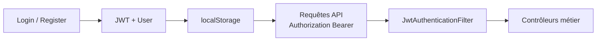

# Auth — Vue d’ensemble

[← Module auth](./README.md)

## Principe

- Authentification **stateless** : pas de session serveur, token **JWT** après login.
- Toutes les routes `/api/**` (sauf login/register) exigent un JWT valide.
- Le frontend stocke le token et l’utilisateur dans `localStorage`.

## Flux simplifié

## Routes publiques (backend)

Configurées dans `SecurityConfig.java` :

- `POST /api/auth/login`
- `POST /api/auth/register`
- Swagger / OpenAPI

Tout le reste sous `/api/**` → **authenticated**.

## Rôles

| Rôle | Usage |
|------|--------|
| `ROLE_CLIENT` | Espace client (demandes de prêt) |
| `ROLE_CONSEILLER` | Traitement dossiers affectés |
| `ROLE_ADMIN` | Vision globale, MAJ dossiers soumis |

Après connexion, le **client** est redirigé vers le shell ; conseiller/admin vers leurs routes dédiées (guards Angular).
