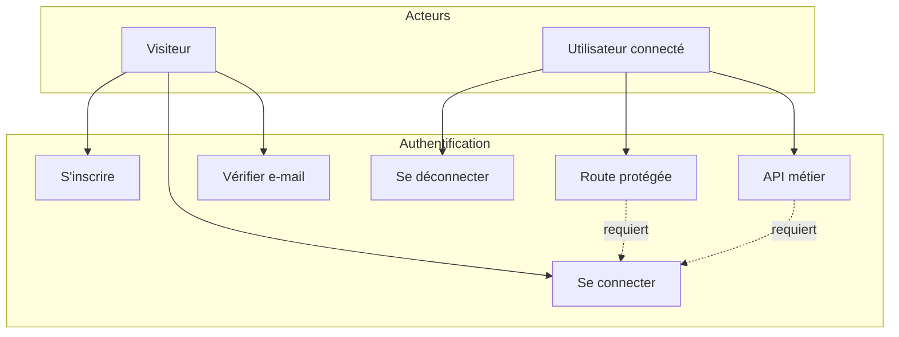

# Auth — Cas d’utilisation

[← Module auth](./README.md)

| UC | Statut |
|----|--------|
| Inscription | ✅ API + UI `/register` |
| Connexion | ✅ API + UI `/login` |
| Déconnexion | ✅ `AuthService.logout()` |
| Vérification e-mail | ⚠️ UI `/verify-email` — flux backend à compléter selon projet |
| Protection routes | ✅ `authGuard`, `roleGuard`, `clientAreaGuard` |
