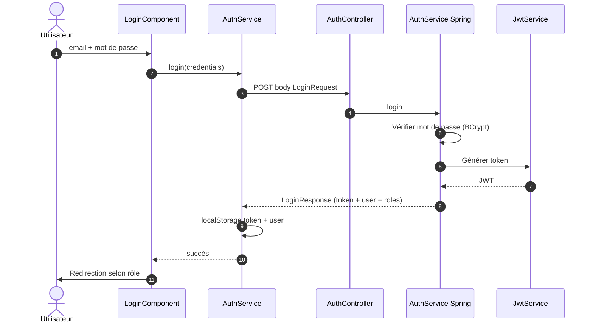
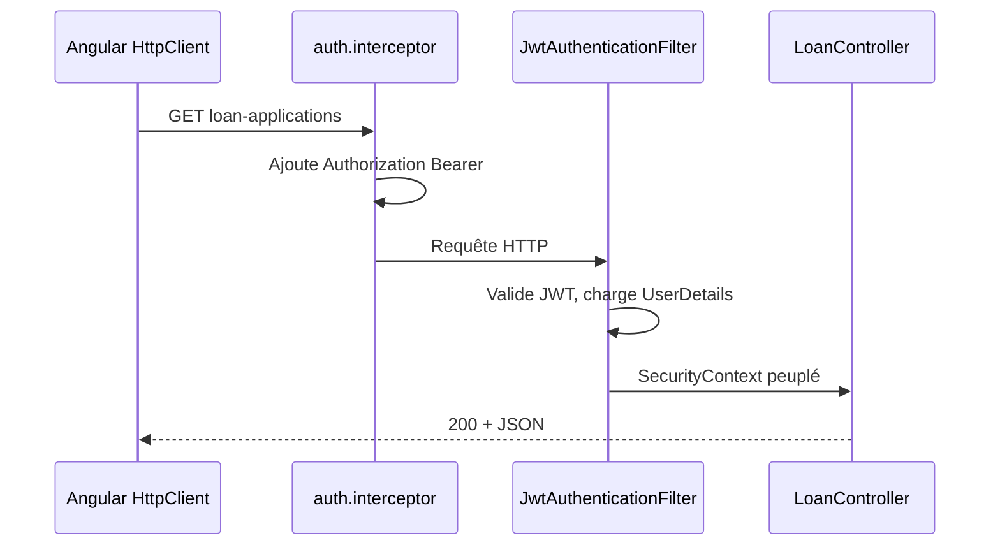
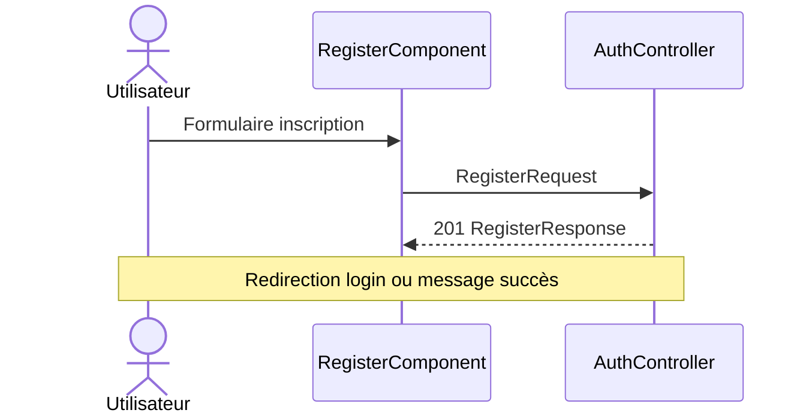
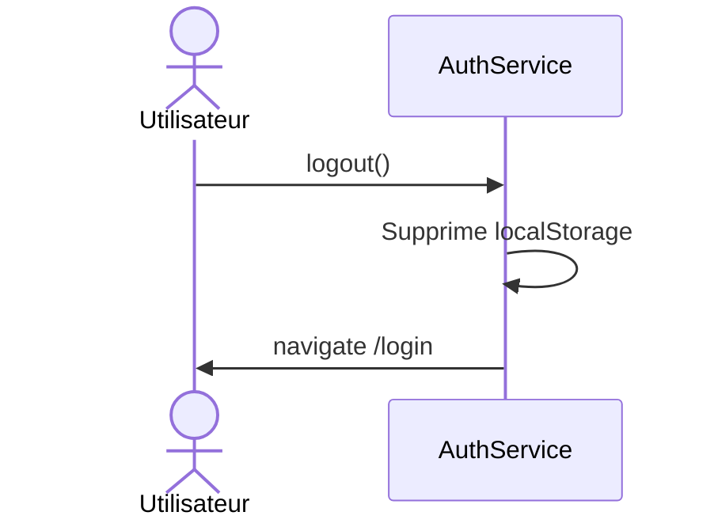

# Auth — Diagrammes de séquence

[← Module auth](./README.md)

## Connexion

```mermaid
sequenceDiagram
  autonumber
  actor U as Utilisateur
  participant UI as LoginComponent
  participant AS as AuthService
  participant API as AuthController
  participant S as AuthService Spring
  participant JWT as JwtService

  U->>UI: email + mot de passe
  UI->>AS: login(credentials)
  AS->>API: POST body LoginRequest
  API->>S: login
  S->>S: Vérifier mot de passe (BCrypt)
  S->>JWT: Générer token
  JWT-->>S: JWT
  S-->>AS: LoginResponse (token + user + roles)
  AS->>AS: localStorage token + user
  AS-->>UI: succès
  UI->>U: Redirection selon rôle
```

## Requête API authentifiée

```mermaid
sequenceDiagram
  participant UI as Angular HttpClient
  participant INT as auth.interceptor
  participant FIL as JwtAuthenticationFilter
  participant CTL as LoanController

  UI->>INT: GET loan-applications
  INT->>INT: Ajoute Authorization Bearer
  INT->>FIL: Requête HTTP
  FIL->>FIL: Valide JWT, charge UserDetails
  FIL->>CTL: SecurityContext peuplé
  CTL-->>UI: 200 + JSON
```

## Inscription

```mermaid
sequenceDiagram
  actor U as Utilisateur
  participant UI as RegisterComponent
  participant API as AuthController

  U->>UI: Formulaire inscription
  UI->>API: RegisterRequest
  API-->>UI: 201 RegisterResponse
  Note over U,API: Redirection login ou message succès
```

## Déconnexion

```mermaid
sequenceDiagram
  actor U as Utilisateur
  participant AS as AuthService

  U->>AS: logout()
  AS->>AS: Supprime localStorage
  AS->>U: navigate /login
```
