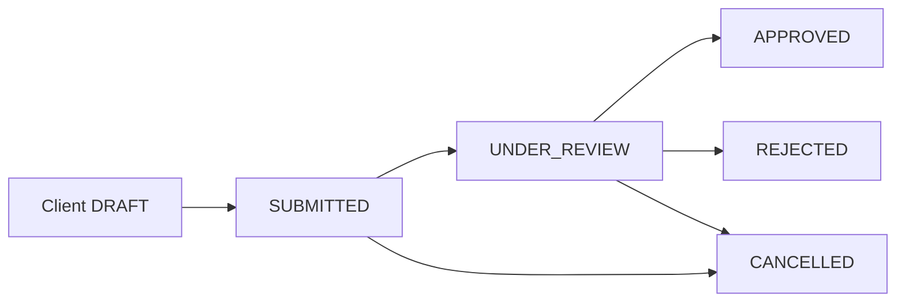
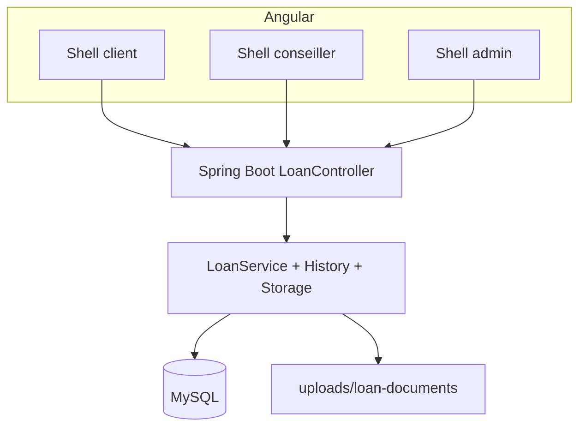

# Vue d’ensemble — Demande de prêt

[← Module](./README.md)

## Objectif

Gérer le **cycle de vie d’une demande de prêt** sur trois espaces :

| Espace | Rôle | Objectif |
|--------|------|----------|
| Client | `ROLE_CLIENT` | Créer, compléter, soumettre, suivre, annuler |
| Conseiller | `ROLE_CONSEILLER` | Instruire les dossiers **qui lui sont affectés**, décider |
| Admin | `ROLE_ADMIN` | Voir **tous** les dossiers, affecter un conseiller, renseigner l’offre |

## Chaîne métier

| Transition | Qui | Moyen |
|------------|-----|--------|
| → `SUBMITTED` | Client | `POST /submit` |
| → `UNDER_REVIEW` | Conseiller | `POST /start-review` |
| → `APPROVED` / `REJECTED` | Conseiller | `POST /approve` / `reject` |
| → `CANCELLED` | Client | `POST /cancel` (`SUBMITTED` / `UNDER_REVIEW`) |
| Affectation + offre | Conseiller ou Admin | `PUT /submitted` |

## Périmètre documenté

| Inclus | Exclu (autres modules) |
|--------|-------------------------|
| CRUD brouillon, documents, workflow statuts | Remboursements, échéancier |
| Historique `loan_application_events` | Messagerie, notifications |
| 3 shells UI (client, conseiller, admin) | Gestion utilisateurs admin |

## Statuts (`LoanApplicationStatus`)

| Statut | Description courte |
|--------|-------------------|
| `DRAFT` | Brouillon client |
| `SUBMITTED` | Dossier déposé, en attente d’instruction |
| `UNDER_REVIEW` | En analyse par le conseiller |
| `APPROVED` | Prêt accordé |
| `REJECTED` | Demande refusée |
| `CANCELLED` | Annulée par le client |

## Architecture technique

Modèle de données : [classes-domaine.puml](../projet/diagrams/classes-domaine.puml).
