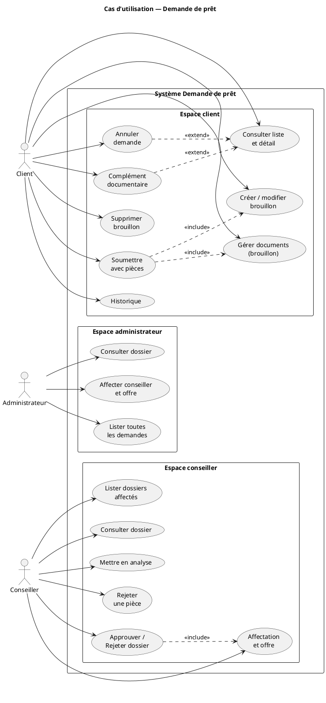

# Cas d’utilisation — Demande de prêt

[← Module](./README.md)

## Acteurs

| Acteur | Rôle applicatif |
|--------|-----------------|
| Client | `ROLE_CLIENT` |
| Conseiller | `ROLE_CONSEILLER` |
| Administrateur | `ROLE_ADMIN` |

## Diagramme (PlantUML — cas d’utilisation UML)

Aperçu : extension **PlantUML** (`Alt+D`) sur ce fichier, ou copier le bloc sur [plantuml.com/plantuml](https://www.plantuml.com/plantuml/uml/).  
Fichier source : [diagrams/cas-utilisation.puml](./diagrams/cas-utilisation.puml).

## Matrice des cas d’utilisation

| UC | Client | Conseiller | Admin |
|----|:------:|:----------:|:-----:|
| Créer / modifier brouillon (wizard) | ✅ | — | — |
| Gérer documents (brouillon) | ✅ | — | — |
| Supprimer brouillon | ✅ | ✅* | ✅* |
| Soumettre | ✅ | — | — |
| Consulter liste | ses dossiers | affectés | tous |
| Consulter détail + historique | ✅ | ✅ | ✅ |
| Annuler (`SUBMITTED` / `UNDER_REVIEW`) | ✅ | — | — |
| Complément documentaire | ✅ | — | — |
| Mettre en analyse | — | ✅ | — |
| `PUT /submitted` (offre + affectation) | — | ✅ | ✅ |
| Rejeter un document | — | ✅ | — |
| Approuver / Rejeter dossier | — | ✅ | — |

\* Conseiller / admin : suppression hors règle `DRAFT` client (cf. `LoanService.deleteApplication`).

## Règles transverses

- **5 pièces obligatoires** à la soumission : identité, bulletins, avis d’imposition, relevés, domicile.
- Fichiers : PDF / JPG / PNG, max **10 Mo**.
- Un conseiller ne voit que les dossiers où il est `assignedAdvisor` ; l’admin voit tout.
