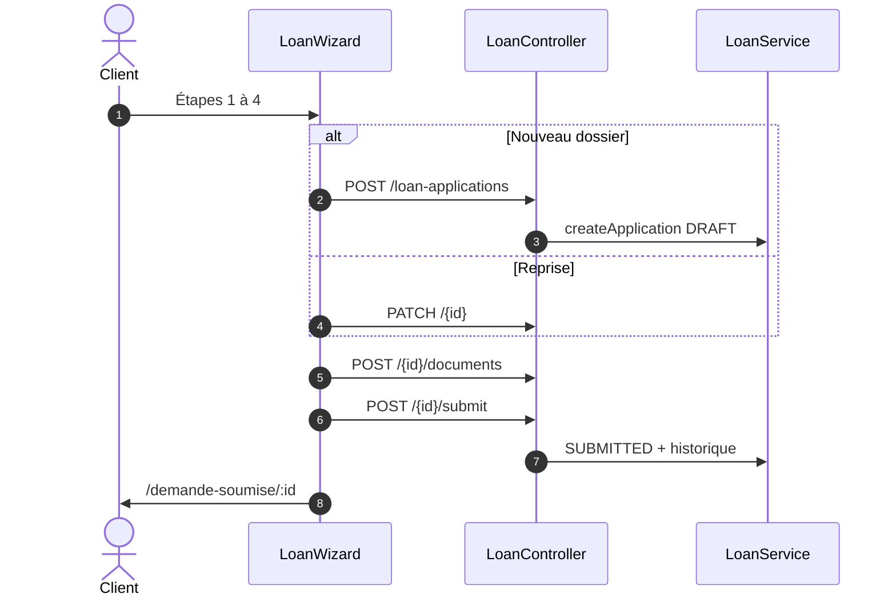
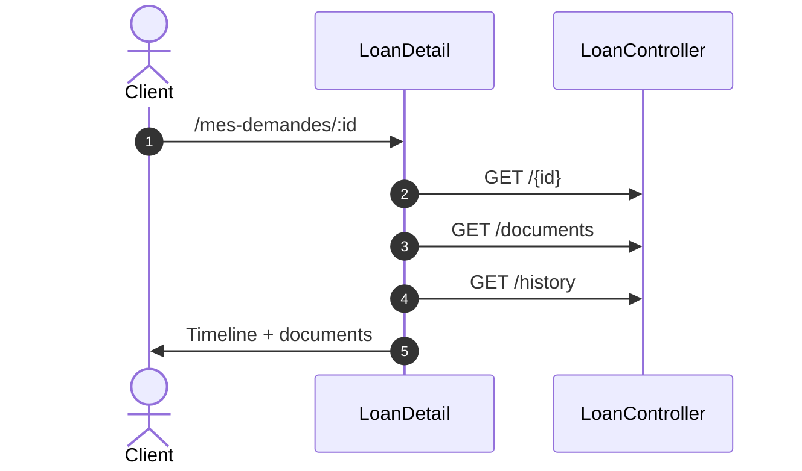
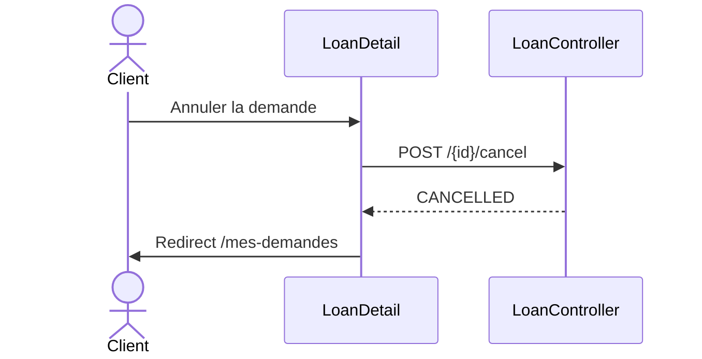
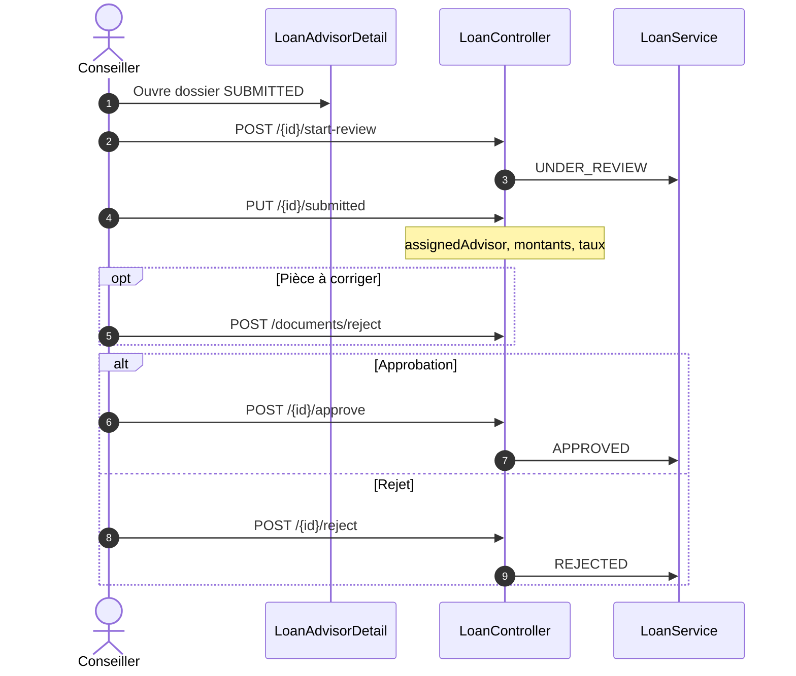
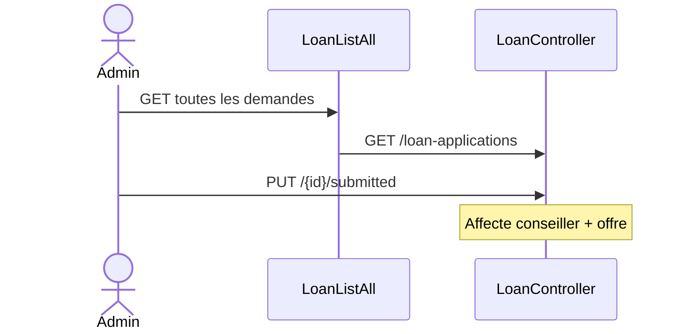
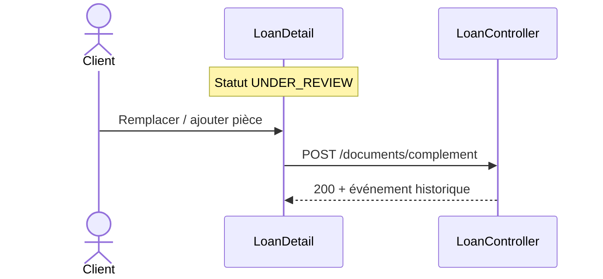

# Séquences — Demande de prêt

[← Module](./README.md)

## 1. Client — Wizard et soumission

## 2. Client — Suivi et historique

## 3. Client — Annulation

## 4. Conseiller — Instruction et décision

## 5. Admin — Affectation

## 6. Client — Complément (pendant analyse)

