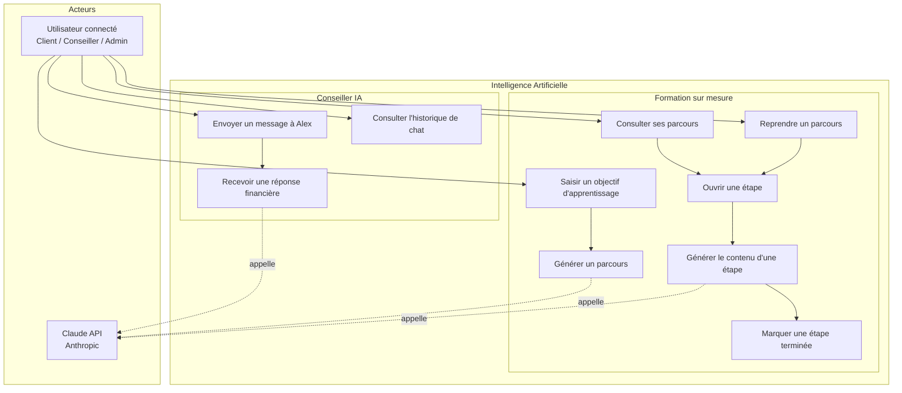

# IA — Cas d'utilisation

[← Module IA](./README.md)

| UC | Fonctionnalité | Statut |
|----|---------------|--------|
| Envoyer un message à Alex | Conseiller IA | ✅ `POST /api/ai/chat` |
| Recevoir une réponse financière | Conseiller IA | ✅ Réponse Claude en temps réel |
| Consulter l'historique de chat | Conseiller IA | ✅ Géré côté frontend (signals) — non persisté |
| Saisir un objectif d'apprentissage | Formation | ✅ Vue `goal-input` |
| Générer un parcours (roadmap) | Formation | ✅ `POST /api/ai/learning/roadmap` |
| Consulter ses parcours | Formation | ✅ `GET /api/ai/learning/sessions` |
| Ouvrir une étape | Formation | ✅ Vue `step-detail` |
| Générer le contenu d'une étape | Formation | ✅ `POST /sessions/{id}/steps/{i}/content` |
| Marquer une étape terminée | Formation | ✅ `PATCH /sessions/{id}/steps/{i}/complete` |
| Reprendre un parcours | Formation | ✅ `resumeSession()` → vue `roadmap` |
