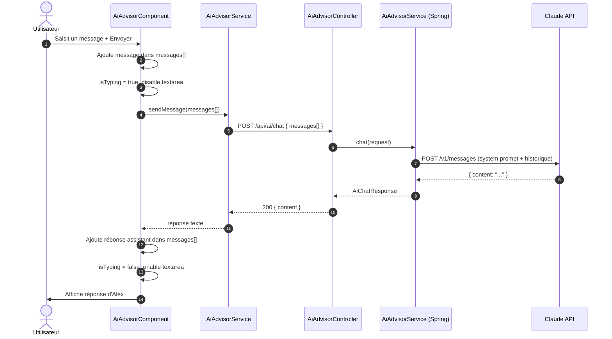
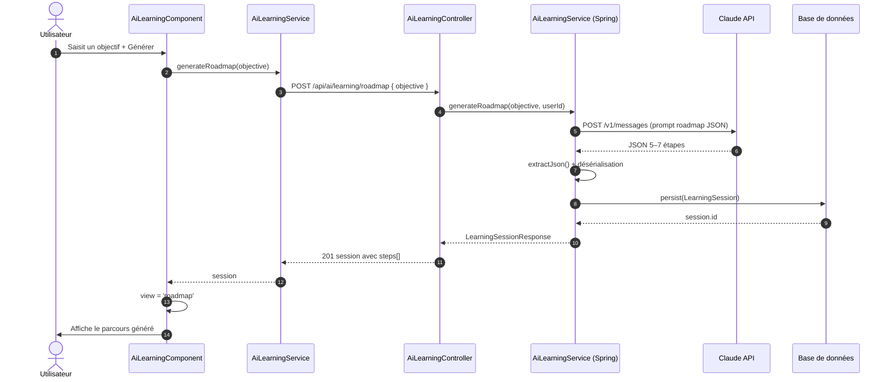
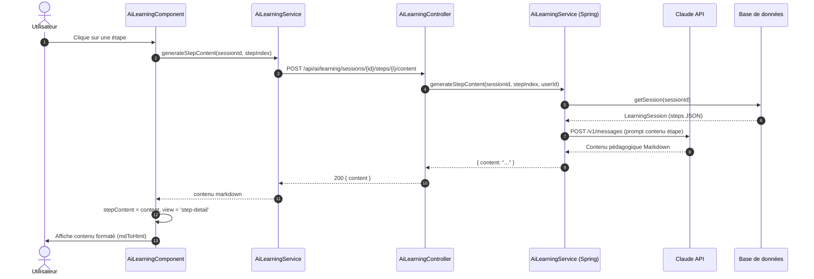
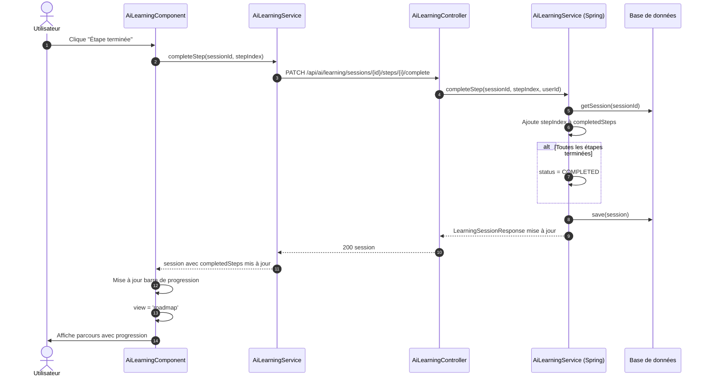

# IA — Diagrammes de séquence

[← Module IA](./README.md)

## Conseiller IA — Envoi d'un message

## Formation — Génération d'un parcours

## Formation — Génération du contenu d'une étape

## Formation — Complétion d'une étape

