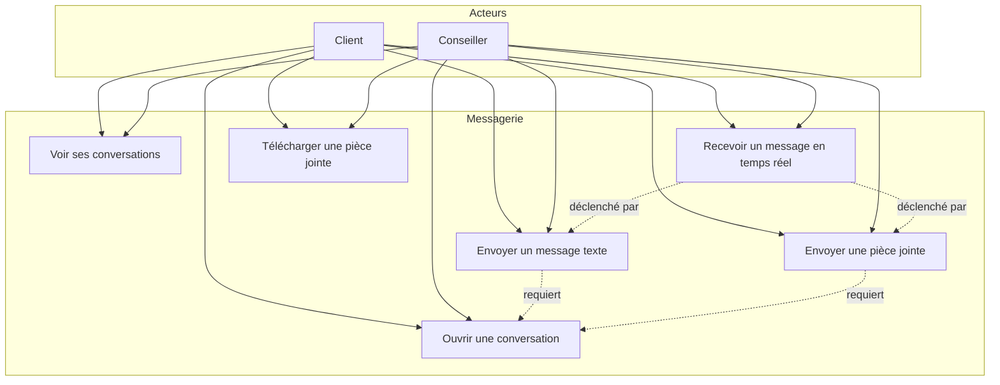

# Messagerie — Cas d'utilisation

[← Module messagerie](./README.md)

| UC | Acteurs | Statut |
|----|---------|--------|
| Voir ses conversations | Client, Conseiller | ✅ `GET /api/messaging/conversations` |
| Ouvrir une conversation | Client, Conseiller | ✅ `GET /api/messaging/conversations/{id}/messages` |
| Envoyer un message texte | Client, Conseiller | ✅ STOMP `SEND /app/chat.send` |
| Envoyer une pièce jointe | Client, Conseiller | ✅ `POST /messages/upload` (multipart) |
| Recevoir en temps réel | Client, Conseiller | ✅ STOMP push `/user/queue/messages` |
| Télécharger une pièce jointe | Client, Conseiller | ✅ URL dans `attachment_url` |
