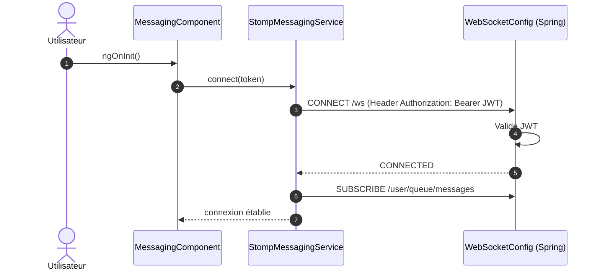
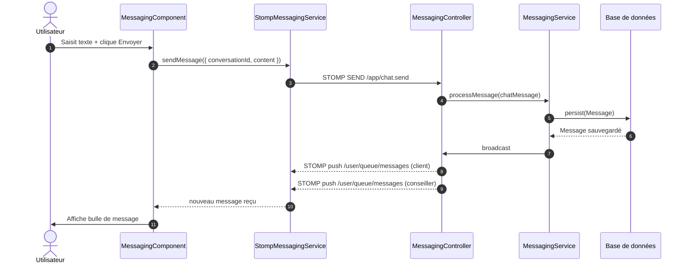
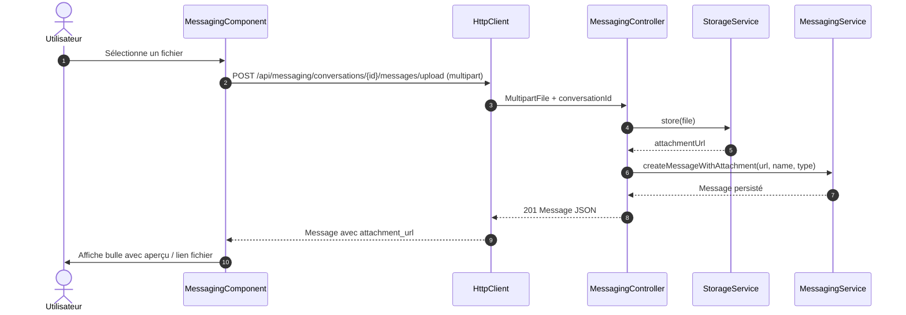
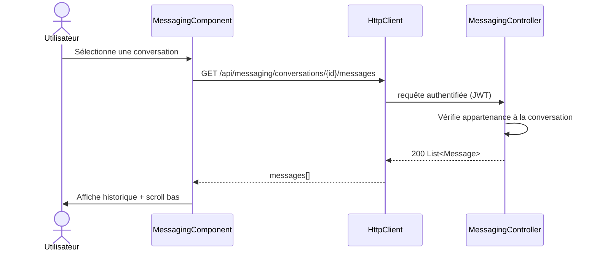

# Messagerie — Diagrammes de séquence

[← Module messagerie](./README.md)

## Connexion WebSocket

```mermaid
sequenceDiagram
  autonumber
  actor U as Utilisateur
  participant CM as MessagingComponent
  participant SS as StompMessagingService
  participant WS as WebSocketConfig (Spring)

  U->>CM: ngOnInit()
  CM->>SS: connect(token)
  SS->>WS: CONNECT /ws (Header Authorization: Bearer JWT)
  WS->>WS: Valide JWT
  WS-->>SS: CONNECTED
  SS->>WS: SUBSCRIBE /user/queue/messages
  SS-->>CM: connexion établie
```

## Envoi d'un message texte

```mermaid
sequenceDiagram
  autonumber
  actor U as Utilisateur
  participant CM as MessagingComponent
  participant SS as StompMessagingService
  participant MC as MessagingController
  participant MS as MessagingService
  participant DB as Base de données

  U->>CM: Saisit texte + clique Envoyer
  CM->>SS: sendMessage({ conversationId, content })
  SS->>MC: STOMP SEND /app/chat.send
  MC->>MS: processMessage(chatMessage)
  MS->>DB: persist(Message)
  DB-->>MS: Message sauvegardé
  MS->>MC: broadcast
  MC-->>SS: STOMP push /user/queue/messages (client)
  MC-->>SS: STOMP push /user/queue/messages (conseiller)
  SS-->>CM: nouveau message reçu
  CM->>U: Affiche bulle de message
```

## Upload d'une pièce jointe

```mermaid
sequenceDiagram
  autonumber
  actor U as Utilisateur
  participant CM as MessagingComponent
  participant HTTP as HttpClient
  participant MC as MessagingController
  participant STOR as StorageService
  participant MS as MessagingService

  U->>CM: Sélectionne un fichier
  CM->>HTTP: POST /api/messaging/conversations/{id}/messages/upload (multipart)
  HTTP->>MC: MultipartFile + conversationId
  MC->>STOR: store(file)
  STOR-->>MC: attachmentUrl
  MC->>MS: createMessageWithAttachment(url, name, type)
  MS-->>MC: Message persisté
  MC-->>HTTP: 201 Message JSON
  HTTP-->>CM: Message avec attachment_url
  CM->>U: Affiche bulle avec aperçu / lien fichier
```

## Chargement de l'historique

```mermaid
sequenceDiagram
  actor U as Utilisateur
  participant CM as MessagingComponent
  participant HTTP as HttpClient
  participant MC as MessagingController

  U->>CM: Sélectionne une conversation
  CM->>HTTP: GET /api/messaging/conversations/{id}/messages
  HTTP->>MC: requête authentifiée (JWT)
  MC->>MC: Vérifie appartenance à la conversation
  MC-->>HTTP: 200 List<Message>
  HTTP-->>CM: messages[]
  CM->>U: Affiche historique + scroll bas
```
