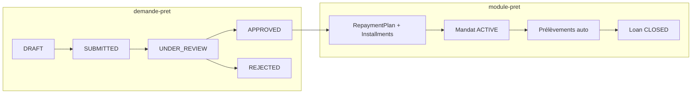
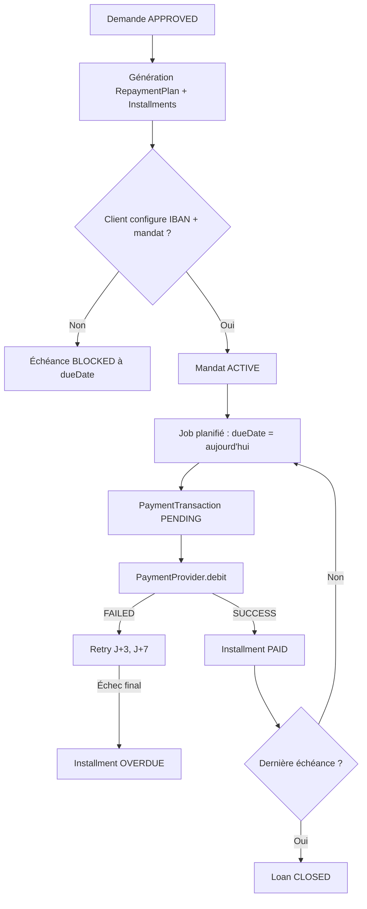
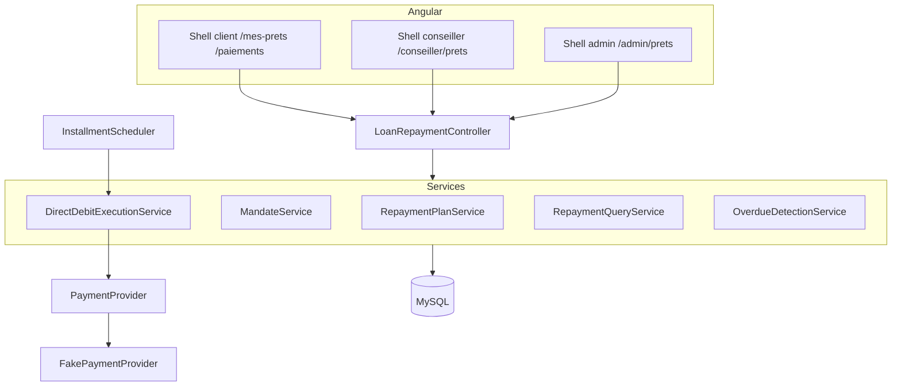

# Vue d’ensemble — Prêt & Paiements

[← Module](./README.md)

## Objectif

Gérer le **cycle de vie du remboursement** après qu’une demande de prêt est **`APPROVED`** :

| Espace | Rôle | Objectif |
|--------|------|----------|
| Client | `ROLE_CLIENT` | Configurer le prélèvement (IBAN + mandat), consulter prêts et échéancier |
| Système | — | Générer le plan, déclencher les prélèvements, gérer retries et retards |
| Conseiller | `ROLE_CONSEILLER` | Superviser les prêts de ses clients (lecture seule) |
| Admin | `ROLE_ADMIN` | KPI recouvrement, consultation globale (lecture seule) |

## Lien avec le module « Demande de prêt »

| Étape | Module | Déclencheur |
|-------|--------|-------------|
| Instruction dossier | `demande-pret` | Conseiller → `APPROVED` |
| Création du prêt | `module-pret` | Événement `FUNDS_RELEASED` / listener sur `APPROVED` |
| Mandat client | `module-pret` | Action client post-approbation |
| Exécution paiements | `module-pret` | `InstallmentScheduler` (cron) |

## Chaîne métier — remboursement

## Périmètre documenté

| Inclus | Exclu (MVP) |
|--------|-------------|
| Entité `Loan` distincte de `LoanApplication` | Vrai PSP (Stripe, GoCardless) — architecture prête |
| Plan d’amortissement + échéances | Remboursement anticipé (V2) |
| Mandat prélèvement + IBAN masqué | Webhooks PSP réels (V2) |
| `PaymentProvider` + `FakePaymentProvider` | Saisie manuelle paiement par conseiller |
| Scheduler quotidien | Relances email/SMS (V2) |
| Consultation client / conseiller / admin | Messagerie liée aux échecs (V2) |

## Statuts

### `LoanStatus` (prêt en cours)

| Statut | Description |
|--------|-------------|
| `PENDING_MANDATE` | Plan généré, mandat client non actif |
| `ACTIVE` | Au moins une échéance à venir, mandat actif |
| `DEFAULTED` | ≥ 2 échéances `OVERDUE` (règle MVP) |
| `CLOSED` | Toutes les échéances `PAID` |

### `InstallmentStatus`

| Statut | Description |
|--------|-------------|
| `UPCOMING` | Échéance future |
| `DUE` | Date d’échéance atteinte, prélèvement en cours |
| `PAID` | Prélèvement réussi |
| `FAILED` | Dernière tentative échouée, retries restants |
| `OVERDUE` | Retries épuisés |
| `BLOCKED` | Pas de mandat actif à l’échéance |

### `DirectDebitMandateStatus`

| Statut | Description |
|--------|-------------|
| `PENDING` | IBAN saisi, en attente de confirmation |
| `ACTIVE` | Mandat signé / actif |
| `REVOKED` | Révoqué par le client |

### `PaymentTransactionStatus`

| Statut | Description |
|--------|-------------|
| `PENDING` | Tentative créée |
| `SUCCESS` | Prélèvement accepté par le PSP |
| `FAILED` | Refus (fonds insuffisants, compte clos…) |
| `CANCELLED` | Annulée (ex. mandat révoqué avant exécution) |

## Décisions métier retenues (MVP)

| Question | Décision |
|----------|----------|
| Quand saisir l’IBAN ? | **Juste après `APPROVED`**, avant la 1ʳᵉ échéance |
| Pas de mandat à l’échéance ? | Échéance `BLOCKED` + alerte client |
| Politique retry | **3 tentatives** : J+0, J+3, J+7 → puis `OVERDUE` |
| Remboursement anticipé | **Hors MVP** |
| Intégration bancaire | **Niveau B** : interface `PaymentProvider` + fake |
| Conseiller enregistre un paiement ? | **Non** — US-4.3 supprimée |

## Architecture technique

Modèle détaillé : [04-entites-modele.md](./04-entites-modele.md).
