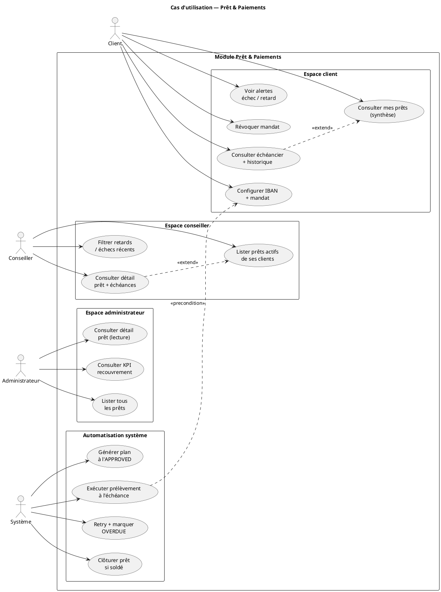

# Cas d’utilisation — Prêt & Paiements

[← Module](./README.md)

## Acteurs

| Acteur | Rôle applicatif |
|--------|-----------------|
| Client | `ROLE_CLIENT` |
| Conseiller | `ROLE_CONSEILLER` |
| Administrateur | `ROLE_ADMIN` |
| Système | Scheduler + `PaymentProvider` (pas d’interface humaine) |

## Diagramme (PlantUML)

Aperçu : extension **PlantUML** (`Alt+D`) ou [plantuml.com/plantuml](https://www.plantuml.com/plantuml/uml/).  
Fichier source : [diagrams/cas-utilisation.puml](./diagrams/cas-utilisation.puml).

## Matrice des cas d’utilisation

| UC | Client | Conseiller | Admin | Système |
|----|:------:|:----------:|:-----:|:-------:|
| UC_C1 — Configurer IBAN + mandat | ✅ | — | — | — |
| UC_C2 — Consulter mes prêts (synthèse) | ✅ | — | — | — |
| UC_C3 — Échéancier + historique prélèvements | ✅ | — | — | — |
| UC_C4 — Voir alertes échec / retard | ✅ | — | — | — |
| UC_C5 — Révoquer mandat | ✅ | — | — | — |
| UC_O1 — Lister prêts actifs (clients affectés) | — | ✅ | — | — |
| UC_O2 — Détail prêt + échéances (lecture) | — | ✅ | — | — |
| UC_O3 — Filtrer retards / échecs | — | ✅ | — | — |
| UC_A1 — KPI recouvrement | — | — | ✅ | — |
| UC_A2 — Lister tous les prêts | — | — | ✅ | — |
| UC_A3 — Détail prêt (lecture) | — | — | ✅ | — |
| UC_S1 — Générer plan à l’APPROVED | — | — | — | ✅ |
| UC_S2 — Exécuter prélèvement | — | — | — | ✅ |
| UC_S3 — Retry + OVERDUE | — | — | — | ✅ |
| UC_S4 — Clôturer prêt soldé | — | — | — | ✅ |

## Règles transverses

- **Aucun acteur humain** n’enregistre un paiement manuellement.
- Le conseiller ne voit que les prêts des clients dont il était `assignedAdvisor` sur la demande source.
- L’admin voit **tous** les prêts ; pas d’action de paiement.
- IBAN affiché **masqué** (`FR76 **** **** 1234`) ; jamais en clair dans les logs.
- Un prélèvement = une `PaymentTransaction` ; idempotence par `(installmentId, attemptNumber)`.
- Mandat `ACTIVE` requis pour exécuter un prélèvement ; sinon échéance `BLOCKED`.

## Hors périmètre MVP

| Exclu | Version |
|-------|---------|
| Remboursement anticipé | V2 |
| Vrai PSP + webhooks | V2 (interface prête) |
| Relances email / SMS | V2 |
| Export PDF échéancier | V2 (optionnel) |
