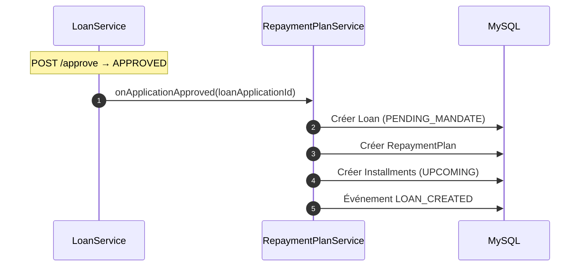
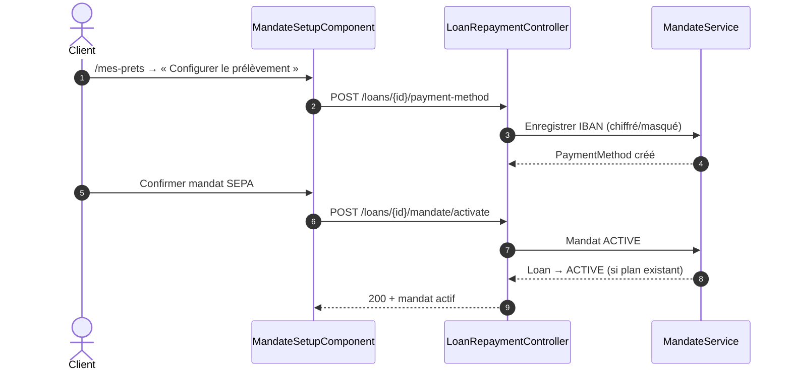
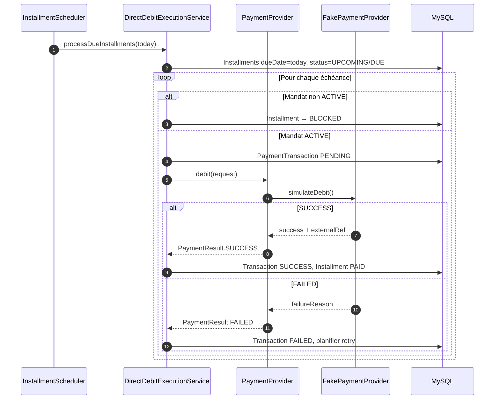
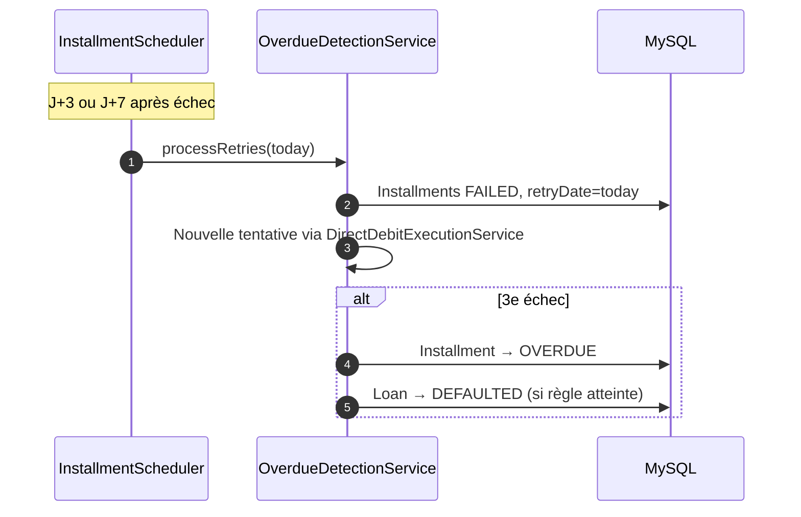
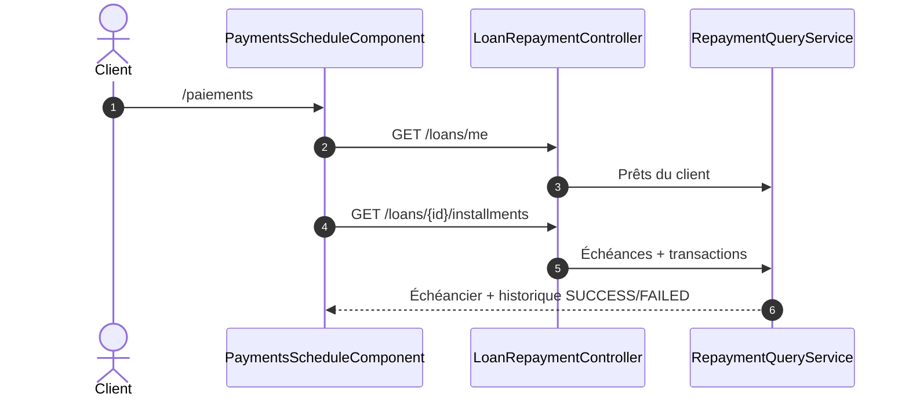
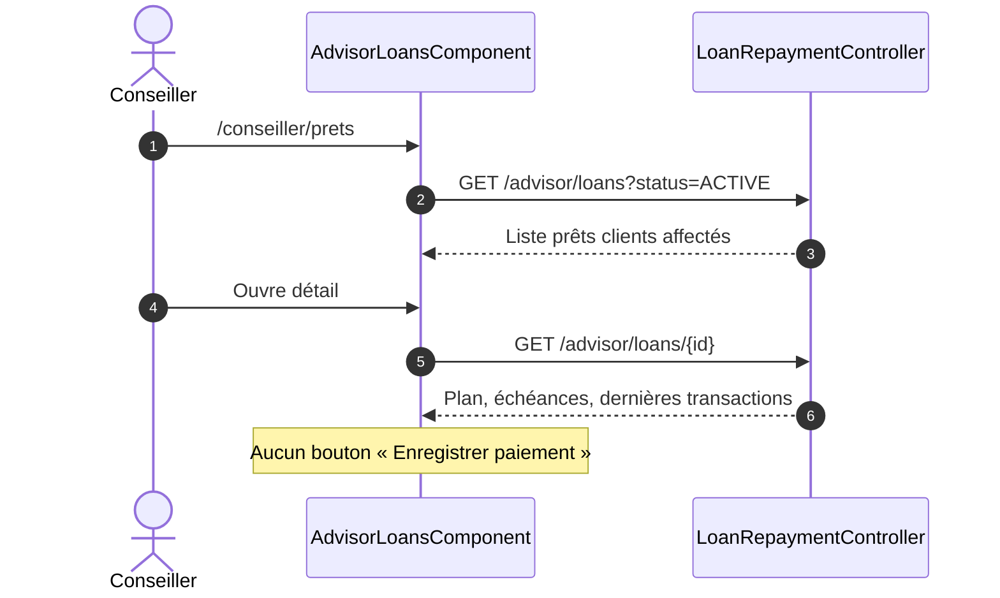
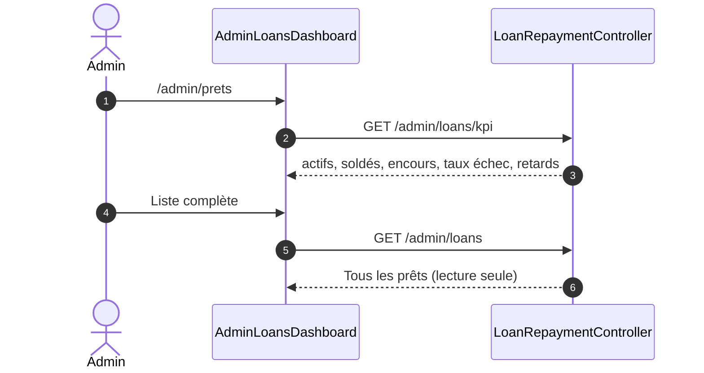
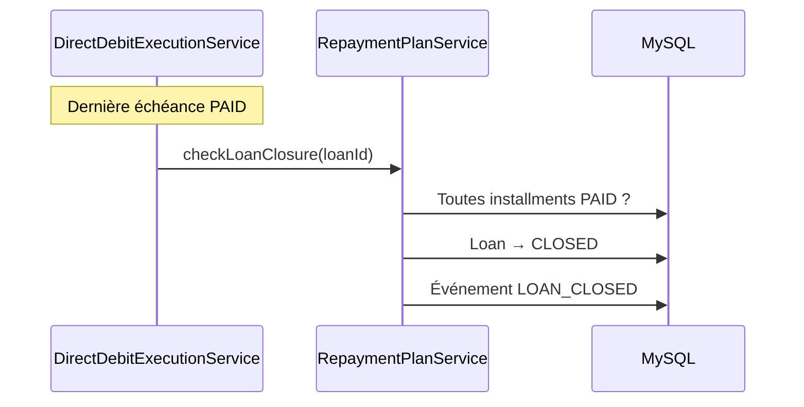

# Séquences — Prêt & Paiements

[← Module](./README.md)

## 1. Système — Génération du plan à l’approbation

## 2. Client — Configuration IBAN et mandat

## 3. Système — Prélèvement automatique (échéance du jour)

## 4. Système — Retry et passage en retard

## 5. Client — Consultation échéancier

## 6. Conseiller — Consultation (lecture seule)

## 7. Admin — KPI recouvrement

## 8. Clôture automatique du prêt

