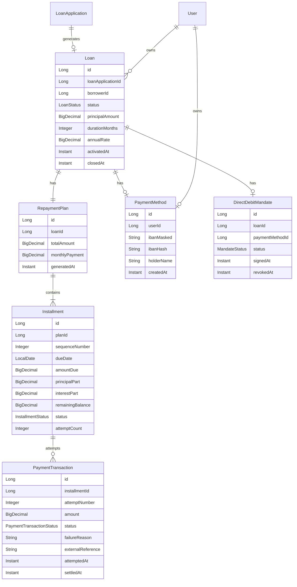

# Entités & modèle — Prêt & Paiements

[← Module](./README.md)

## Séparation Demande vs Prêt

| Entité | Rôle | Cycle de vie |
|--------|------|--------------|
| `LoanApplication` | Demande de crédit | `DRAFT` → … → `APPROVED` / `REJECTED` |
| `Loan` | Prêt en cours de remboursement | `PENDING_MANDATE` → `ACTIVE` → `CLOSED` / `DEFAULTED` |

Une `LoanApplication` **approuvée** génère **un** `Loan` (relation 1:1).

## Diagramme entités (simplifié)



## Entités JPA (cible)

### `Loan`

| Champ | Type | Notes |
|-------|------|-------|
| `id` | `Long` | PK |
| `loanApplication` | `@OneToOne` | Demande source |
| `borrower` | `@ManyToOne User` | Client |
| `assignedAdvisor` | `@ManyToOne User` | Copié depuis la demande |
| `status` | `LoanStatus` | |
| `principalAmount` | `BigDecimal` | Montant accordé |
| `durationMonths` | `Integer` | |
| `annualRate` | `BigDecimal` | |
| `activatedAt` | `Instant` | Mandat actif |
| `closedAt` | `Instant` | nullable |

### `RepaymentPlan`

| Champ | Type | Notes |
|-------|------|-------|
| `loan` | `@OneToOne` | |
| `totalRepayable` | `BigDecimal` | Capital + intérêts |
| `monthlyPayment` | `BigDecimal` | Mensualité constante (amortissement) |
| `installmentCount` | `Integer` | = `durationMonths` |

### `Installment`

| Champ | Type | Notes |
|-------|------|-------|
| `sequenceNumber` | `Integer` | 1..N |
| `dueDate` | `LocalDate` | |
| `amountDue` | `BigDecimal` | |
| `principalPart` | `BigDecimal` | |
| `interestPart` | `BigDecimal` | |
| `remainingBalance` | `BigDecimal` | Solde après échéance |
| `status` | `InstallmentStatus` | |
| `attemptCount` | `Integer` | Nombre de tentatives |

### `PaymentMethod`

| Champ | Type | Notes |
|-------|------|-------|
| `user` | `@ManyToOne` | |
| `ibanMasked` | `String` | Affichage UI |
| `ibanEncrypted` | `String` | Stockage (ou hash + ref vault) |
| `holderName` | `String` | |

### `DirectDebitMandate`

| Champ | Type | Notes |
|-------|------|-------|
| `loan` | `@OneToOne` | |
| `paymentMethod` | `@ManyToOne` | |
| `status` | `MandateStatus` | |
| `signedAt` | `Instant` | |
| `revokedAt` | `Instant` | nullable |

### `PaymentTransaction`

| Champ | Type | Notes |
|-------|------|-------|
| `installment` | `@ManyToOne` | |
| `attemptNumber` | `Integer` | 1, 2, 3 |
| `amount` | `BigDecimal` | |
| `status` | `PaymentTransactionStatus` | |
| `failureReason` | `String` | ex. `insufficient_funds` |
| `externalReference` | `String` | ID retourné par le PSP |
| `attemptedAt` | `Instant` | |
| `settledAt` | `Instant` | nullable |

## Interface `PaymentProvider` (niveau B)

```java
public interface PaymentProvider {

    PaymentResult debit(DebitRequest request);

    record DebitRequest(
        String mandateReference,
        String ibanToken,      // référence interne, pas l'IBAN brut
        BigDecimal amount,
        String currency,
        String idempotencyKey  // ex. "installment-{id}-attempt-{n}"
    ) {}

    record PaymentResult(
        PaymentTransactionStatus status,
        String externalReference,
        String failureReason     // nullable si SUCCESS
    ) {}
}
```

### `FakePaymentProvider` (implémentation projet)

| Comportement | Configuration |
|--------------|---------------|
| Succès par défaut | `app.payment.fake.always-success=true` |
| Échec simulé | `app.payment.fake.fail-rate=0.1` (10 % aléatoire) |
| Échec forcé par IBAN test | IBAN `FR7630001007941234567890185` → `insufficient_funds` |
| Délai simulé | `app.payment.fake.delay-ms=200` |

Permet de démontrer en soutenance : succès, échec, retry, `OVERDUE`.

## Services backend (cible)

| Service | Responsabilité |
|---------|----------------|
| `RepaymentPlanService` | Calcul amortissement, génération échéances à l’`APPROVED` |
| `MandateService` | CRUD `PaymentMethod`, activation / révocation mandat |
| `DirectDebitExecutionService` | Orchestre un prélèvement (transaction + appel PSP) |
| `InstallmentScheduler` | Cron quotidien : échéances dues + retries |
| `OverdueDetectionService` | `FAILED` → `OVERDUE`, `Loan` → `DEFAULTED` |
| `RepaymentQueryService` | APIs lecture client / conseiller / admin |

## Événements historique (extension)

À journaliser dans `loan_application_events` ou table dédiée `loan_repayment_events` :

| Type | Déclencheur |
|------|-------------|
| `LOAN_CREATED` | Plan généré |
| `MANDATE_ACTIVATED` | Client active le mandat |
| `MANDATE_REVOKED` | Client révoque |
| `PAYMENT_SUCCEEDED` | Transaction SUCCESS |
| `PAYMENT_FAILED` | Transaction FAILED |
| `INSTALLMENT_OVERDUE` | Retries épuisés |
| `LOAN_CLOSED` | Dernière échéance payée |
| `LOAN_DEFAULTED` | Règle défaut atteinte |

## Calcul d’amortissement (rappel)

Formule mensualité constante (taux annuel `r`, durée `n` mois, capital `C`) :

```
mensualité = C × (r/12) / (1 - (1 + r/12)^(-n))
```

Chaque échéance : intérêts = solde × (r/12), capital = mensualité − intérêts.

Implémentation cible : `RepaymentPlanService.generateInstallments()`.

## Tables SQL (noms suggérés)

| Table | Entité |
|-------|--------|
| `loans` | `Loan` |
| `repayment_plans` | `RepaymentPlan` |
| `installments` | `Installment` |
| `payment_methods` | `PaymentMethod` |
| `direct_debit_mandates` | `DirectDebitMandate` |
| `payment_transactions` | `PaymentTransaction` |
