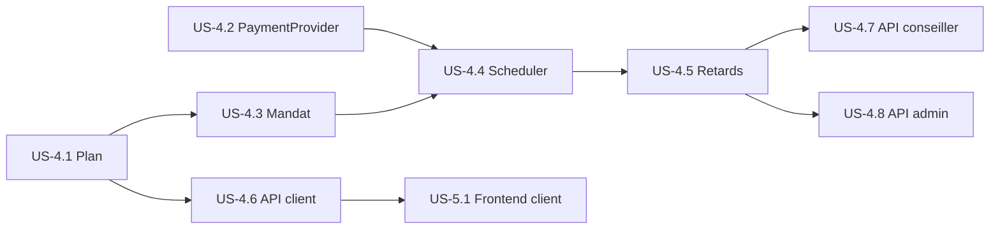

# User stories Jira — Prêt & Paiements (Sprint 4 révisé)

[← Module](./README.md)

Backlog aligné sur le modèle **prélèvement automatique** + `PaymentProvider` fake.  
**US-4.3 « conseiller enregistre le paiement » est supprimée.**

---

## Epic

**EPIC-4 — Module Prêt & Remboursement automatique**

> Après approbation d’une demande, le système génère un plan d’amortissement, le client configure un mandat de prélèvement, et les échéances sont débitées automatiquement via un `PaymentProvider` (simulation en dev).

---

## Sprint 4 — Backend fondations

### US-4.1 — Génération du plan à l’approbation

**En tant que** système,  
**je veux** créer automatiquement un `Loan`, un `RepaymentPlan` et les `Installment` lorsqu’une demande passe à `APPROVED`,  
**afin de** démarrer le cycle de remboursement sans intervention manuelle.

**Critères d’acceptation :**
- [ ] Listener / appel depuis `LoanService.approve()`
- [ ] Calcul amortissement (mensualité constante)
- [ ] `Loan.status = PENDING_MANDATE`
- [ ] N échéances `UPCOMING` avec dates mensuelles
- [ ] Événement `LOAN_CREATED` journalisé
- [ ] Tests unitaires `RepaymentPlanServiceTest`

**Story points :** 8

---

### US-4.2 — Interface PaymentProvider + FakePaymentProvider

**En tant que** développeur,  
**je veux** une interface `PaymentProvider` et une implémentation `FakePaymentProvider`,  
**afin de** simuler les prélèvements et préparer une intégration PSP réelle (V2).

**Critères d’acceptation :**
- [ ] Interface `PaymentProvider.debit(DebitRequest)`
- [ ] `FakePaymentProvider` : succès par défaut, échec configurable (`fail-rate`, IBAN test)
- [ ] `externalReference` généré (ex. `FAKE-txn-{uuid}`)
- [ ] Idempotence via `idempotencyKey`
- [ ] Configuration `app.payment.provider=fake` dans `application-dev.yml`
- [ ] Tests unitaires `FakePaymentProviderTest`

**Story points :** 5

---

### US-4.3 — Mandat et compte bancaire client *(remplace ancienne US saisie conseiller)*

**En tant que** client,  
**je veux** enregistrer mon IBAN et activer un mandat de prélèvement,  
**afin que** les échéances soient prélevées automatiquement.

**Critères d’acceptation :**
- [ ] `POST /loans/{id}/payment-method` — validation IBAN
- [ ] IBAN stocké masqué en réponse ; jamais loggé en clair
- [ ] `POST /loans/{id}/mandate/activate` → `DirectDebitMandate.ACTIVE`
- [ ] `Loan.status` passe à `ACTIVE`
- [ ] `POST /loans/{id}/mandate/revoke` → `REVOKED`
- [ ] Tests `MandateServiceTest` + tests controller

**Story points :** 8

---

### US-4.4 — Exécution automatique des prélèvements

**En tant que** système,  
**je veux** exécuter les prélèvements des échéances dues via le scheduler,  
**afin de** marquer les échéances comme `PAID` ou `FAILED` sans action humaine.

**Critères d’acceptation :**
- [ ] `InstallmentScheduler` — cron quotidien
- [ ] `DirectDebitExecutionService` crée `PaymentTransaction` et appelle `PaymentProvider`
- [ ] SUCCESS → `Installment.PAID`, `PaymentTransaction.SUCCESS`
- [ ] FAILED → retry planifié (J+3, J+7)
- [ ] Pas de mandat actif → `Installment.BLOCKED`
- [ ] Endpoint dev `POST /internal/scheduler/run-due-installments`
- [ ] Tests `DirectDebitExecutionServiceTest`, `InstallmentSchedulerTest`

**Story points :** 13

---

### US-4.5 — Détection retards et clôture prêt

**En tant que** système,  
**je veux** marquer les échéances en retard et clôturer les prêts soldés,  
**afin de** refléter l’état réel du portefeuille.

**Critères d’acceptation :**
- [ ] Après 3e échec → `Installment.OVERDUE`
- [ ] ≥ 2 échéances `OVERDUE` → `Loan.DEFAULTED`
- [ ] Toutes échéances `PAID` → `Loan.CLOSED`
- [ ] Événements `INSTALLMENT_OVERDUE`, `LOAN_CLOSED`, `LOAN_DEFAULTED`
- [ ] Tests `OverdueDetectionServiceTest`

**Story points :** 5

---

## Sprint 4 — APIs lecture

### US-4.6 — APIs consultation client

**En tant que** client,  
**je veux** consulter mes prêts, mon échéancier et l’historique des prélèvements,  
**afin de** suivre mon remboursement.

**Critères d’acceptation :**
- [ ] `GET /loans/me`, `GET /loans/{id}`, `GET /loans/{id}/installments`, `GET /loans/{id}/transactions`
- [ ] Contrôle d’accès : borrower uniquement
- [ ] DTO avec soldes, prochaine échéance, statuts
- [ ] Tests controller

**Story points :** 5

---

### US-4.7 — APIs consultation conseiller (lecture seule)

**En tant que** conseiller,  
**je veux** consulter les prêts de mes clients affectés,  
**afin de** superviser les remboursements sans intervenir sur les paiements.

**Critères d’acceptation :**
- [ ] `GET /advisor/loans`, `GET /advisor/loans/{id}`
- [ ] Filtre `overdueOnly`, `status`
- [ ] **Aucun endpoint d’écriture** côté paiement pour le conseiller
- [ ] Tests controller

**Story points :** 5

---

### US-4.8 — APIs KPI admin (lecture seule)

**En tant qu’** administrateur,  
**je veux** voir les KPI de recouvrement et la liste de tous les prêts,  
**afin de** piloter la plateforme.

**Critères d’acceptation :**
- [ ] `GET /admin/loans/kpi` — actifs, soldés, encours, encaissé mois, taux échec, retards
- [ ] `GET /admin/loans`, `GET /admin/loans/{id}`
- [ ] Lecture seule — pas de saisie paiement
- [ ] Tests controller

**Story points :** 5

---

## Sprint 5 — Frontend (suggestion)

### US-5.1 — Écran Mes prêts (client)

**En tant que** client,  
**je veux** voir la synthèse de mes prêts actifs,  
**afin de** connaître mon solde et ma prochaine échéance.

**Critères d’acceptation :**
- [ ] Route `/mes-prets` implémentée (remplace `ComingSoon`)
- [ ] Cartes prêt + badges statut + alerte mandat
- [ ] Lien vers configuration mandat si `PENDING_MANDATE`

**Story points :** 5

---

### US-5.2 — Configuration mandat (client)

**En tant que** client,  
**je veux** saisir mon IBAN et activer le mandat,  
**afin de** autoriser les prélèvements automatiques.

**Critères d’acceptation :**
- [ ] Formulaire IBAN + titulaire + consentement
- [ ] Validation frontend + messages d’erreur API
- [ ] Confirmation visuelle mandat actif

**Story points :** 5

---

### US-5.3 — Échéancier et historique (client)

**En tant que** client,  
**je veux** consulter mon échéancier et l’historique des prélèvements,  
**afin de** vérifier les débits passés et à venir.

**Critères d’acceptation :**
- [ ] Route `/paiements` implémentée
- [ ] Tableau échéances + historique transactions
- [ ] Alertes `OVERDUE`, `BLOCKED`, `FAILED`

**Story points :** 8

---

### US-5.4 — Prêts conseiller (lecture seule)

**En tant que** conseiller,  
**je veux** lister et consulter les prêts de mes clients,  
**afin de** détecter les retards sans enregistrer de paiement.

**Critères d’acceptation :**
- [ ] Routes `/conseiller/prets`, `/conseiller/prets/:id`
- [ ] Filtres retard / statut
- [ ] Aucun bouton d’action paiement

**Story points :** 5

---

### US-5.5 — Dashboard prêts admin

**En tant qu’** administrateur,  
**je veux** un tableau de bord KPI et la liste des prêts,  
**afin de** superviser le recouvrement global.

**Critères d’acceptation :**
- [ ] Route `/admin/prets` avec KPI + liste
- [ ] Détail lecture seule

**Story points :** 5

---

## Récapitulatif des changements backlog

| Ancien | Nouveau |
|--------|---------|
| US-4.3 conseiller enregistre paiement | **Supprimé** |
| Paiement manuel | US-4.4 exécution auto + US-4.2 PaymentProvider |
| — | US-4.3 mandat client |
| Conseiller acteur paiement | US-4.7 lecture seule |
| Admin supervision dossiers | US-4.8 KPI remboursement |

## Dépendances

## Estimation totale

| Sprint | Stories | Points |
|--------|---------|--------|
| Sprint 4 backend | US-4.1 → US-4.8 | 54 |
| Sprint 5 frontend | US-5.1 → US-5.5 | 28 |
| **Total** | 13 stories | **82** |
