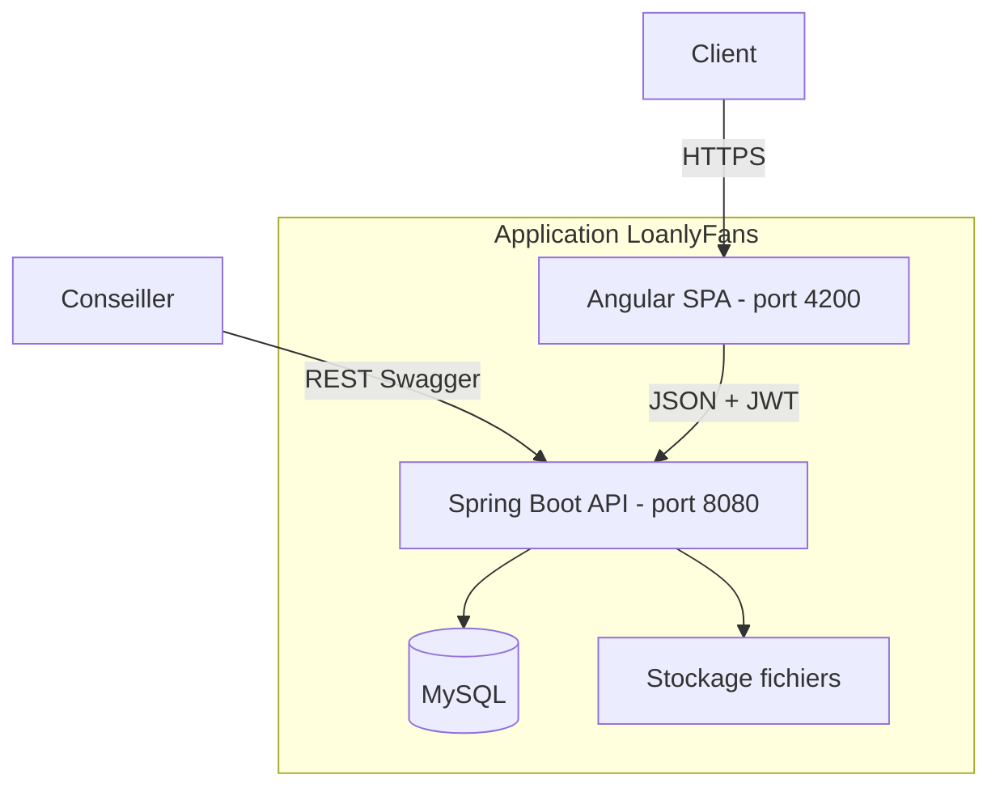

# Vue d’ensemble & architecture

[← Module projet](./README.md) · [← Wiki](../README.md)

## Objectif

**LoanlyFans** — application de gestion de prêts : le **client** dépose une demande ; le **conseiller** instruit et décide via l’API.

## Stack

| Couche | Technologie |
|--------|-------------|
| Frontend | Angular 19, Angular Material |
| Backend | Spring Boot 3, Spring Security, JPA |
| BDD | MySQL (Docker) |
| Auth | JWT stateless |
| Fichiers | Disque `uploads/loan-documents` |

## Architecture (conteneurs)

## Périmètre MVP documenté

| Module wiki | Statut |
|-------------|--------|
| [auth](../auth/README.md) | Implémenté |
| [demande-pret](../demande-pret/README.md) | Client, conseiller, admin (doc complète) |

Structure frontend prêts : `features/loans/applicant` + `core/loans/`.

## Références code racine

| Zone | Chemin |
|------|--------|
| Backend | `backend/src/main/java/com/projetfilrouge/loanmanagement/` |
| Frontend | `frontend/src/app/` |
| Routes | `frontend/src/app/app.routes.ts` |
